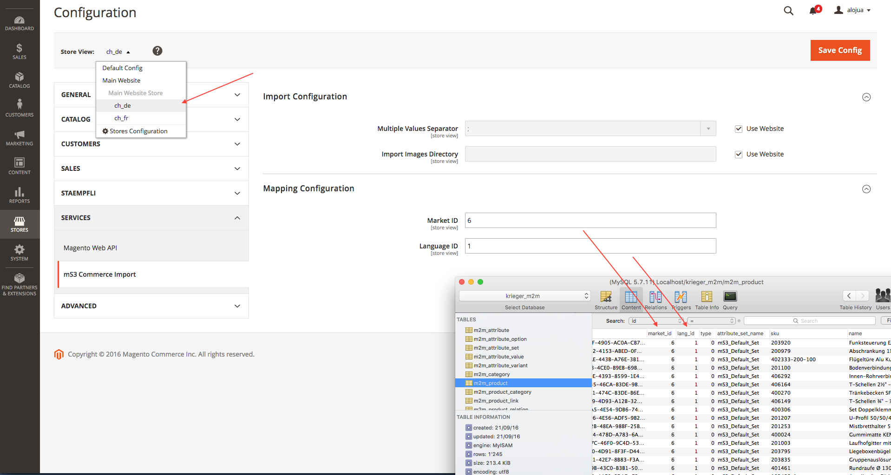
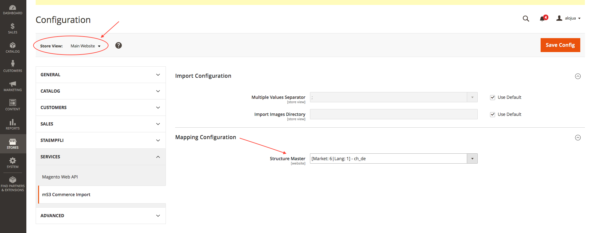
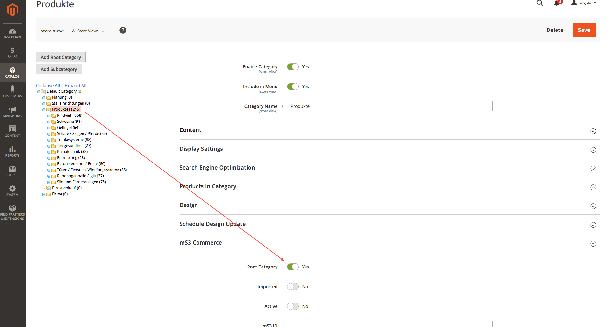

# Admin Configuration

Before we can start importing data, we need to configure a couple of things on the Magento Admin interface:

1. Set Stores mapping (**Store view Scope**): `Stores > Configuration > Services > mS3 Commerce Import > Mapping`

    

2. Set Store Master for Website (**Website Scope**): `Stores > Configuration > Services > mS3 Commerce Import > Mapping`

    

3. OPTIONAL: If you want to import categories in a different Category than the Website default, you can configure that:

    * `Catalog > Categories > Select category > Root Category`
    
    